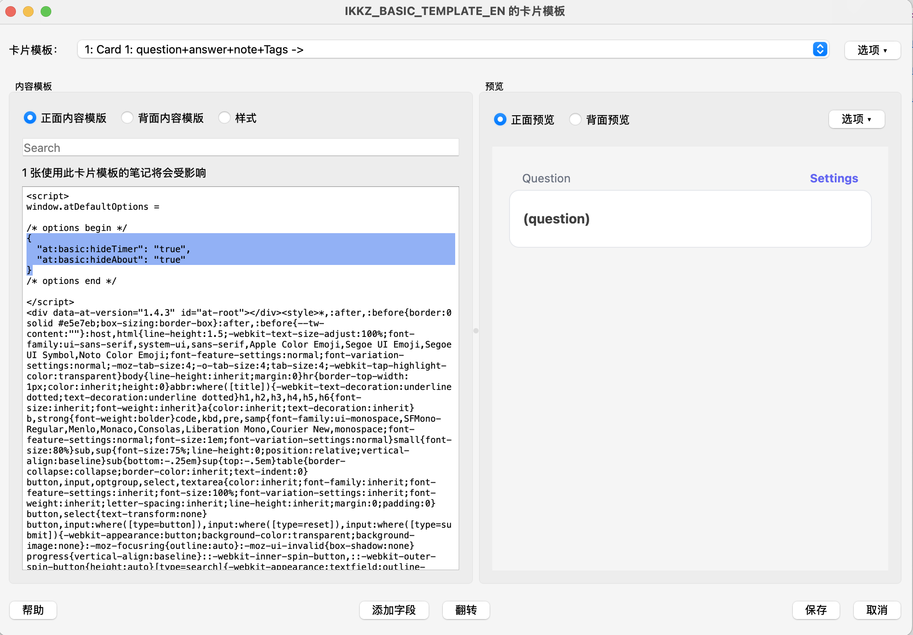

# Overview

::: warning Version 3 migration
Classic Templates 3.0 removes the Markdown variants and the `.native` suffix from download names. If you need Markdown rendering in a custom card template, use the [XMarkdown extension](/extension/xmarkdown).
:::

## Templates

- [Multiple Choice](/templates/classic/mcq)
- [True or False](/templates/classic/tf)
- [Basic](/templates/classic/basic)
- [Match](/templates/classic/match)
- [Ordering](/templates/classic/ordering)
- [Cloze](/templates/classic/cloze)
- [Input](/templates/classic/input)

## Embedding Options in Templates

Since Anki does not provide the ability to store data in templates, there are some issues with user preference settings in templates:

- Cannot sync across multiple devices
- Preferences may be lost when restarting Anki on some clients

To resolve these issues, you need to paste the formatted template settings below into the template code. This process involves two steps:

1. Open the card template settings in Anki. The method to access this varies by platform, so please refer to the official user documentation.
2. Find the "Front Template" of this template and paste the formatted template configuration you see on the settings page into the corresponding location. Below is an example image from the Mac version of Anki, other versions may display differently.

<!--@include: @/parts/feedback-en.md -->
