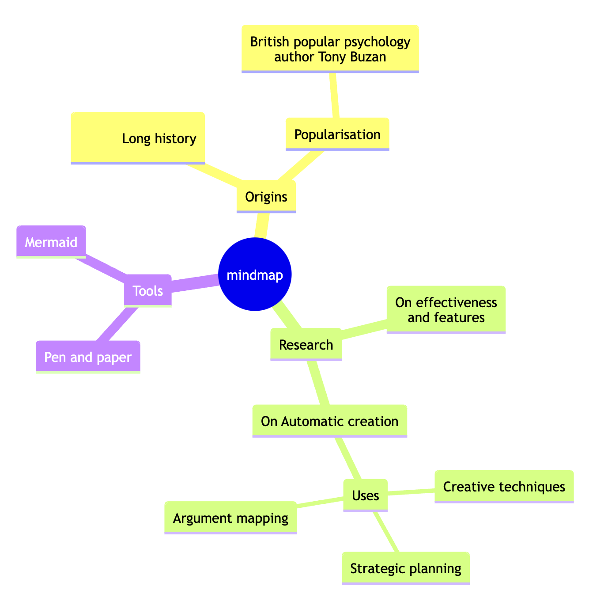

# Overview

## Templates

- [Multiple Choice](/templates/classic/mcq)
- [True or False](/templates/classic/tf)
- [Basic](/templates/classic/basic)
- [Match](/templates/classic/match)
- [Cloze](/templates/classic/cloze)
- [Input](/templates/classic/input)
- [Multiple Choice (10 options)](/templates/classic/mcq_10)
- [Multiple Choice (26 options)](/templates/classic/mcq_26)

## Embedding Options in Templates

Since Anki does not provide the ability to store data in templates, there are some issues with user preference settings in templates:

- Cannot sync across multiple devices
- Preferences may be lost when restarting Anki on some clients

To resolve these issues, you need to paste the formatted template settings below into the template code. This process involves two steps:

1. Open the card template settings in Anki. The method to access this varies by platform, so please refer to the official user documentation.
2. Find the "Front Template" of this template and paste the formatted template configuration you see on the settings page into the corresponding location. Below is an example image from the Mac version of Anki, other versions may display differently.


<a id="markdown-support"></a>

## Markdown support

The markdown format of the template is supported through ByteMD. If you want to preview it in real time while editing, you can use ByteMD's playground directly.

However, please note that not all plugins available in the playground are enabled in the template. For the specific list of enabled plugins, please refer to the template’s markdown renderer implementation.

Below are some of the available formats and examples.

### Markdown Basic Syntax


````markdown
I just love **bold text**. Italicized text is the _cat's meow_. At the command prompt, type `nano`.

My favorite markdown editor is [ByteMD](https://github.com/bytedance/bytemd).

1. First item
2. Second item
3. Third item

> Dorothy followed her through many of the beautiful rooms in her castle.

```js
import gfm from '@bytemd/plugin-gfm';
import { Editor, Viewer } from 'bytemd';

const plugins = [
  gfm(),
  // Add more plugins here
];

const editor = new Editor({
  target: document.body, // DOM to render
  props: {
    value: '',
    plugins,
  },
});

editor.on('change', (e) => {
  editor.$set({ value: e.detail.value });
});
```
````

### GFM Extended Syntax


```markdown
Automatic URL Linking: https://github.com/bytedance/bytemd

~~The world is flat.~~ We now know that the world is round.

- [x] Write the press release
- [ ] Update the website
- [ ] Contact the media

| Syntax    | Description |
| --------- | ----------- |
| Header    | Title       |
| Paragraph | Text        |
```

### Math Equation


```markdown
Inline math equation: $a+b$

$$
\displaystyle \left( \sum_{k=1}^n a_k b_k \right)^2 \leq \left( \sum_{k=1}^n a_k^2 \right) \left( \sum_{k=1}^n b_k^2 \right)
$$
```

### Mermaid Diagrams



````markdown
```mermaid
mindmap
  root((mindmap))
    Origins
      Long history
      ::icon(fa fa-book)
      Popularisation
        British popular psychology author Tony Buzan
    Research
      On effectiveness<br/>and features
      On Automatic creation
        Uses
            Creative techniques
            Strategic planning
            Argument mapping
    Tools
      Pen and paper
      Mermaid
```
````

<!--@include: @/parts/feedback-en.md -->
